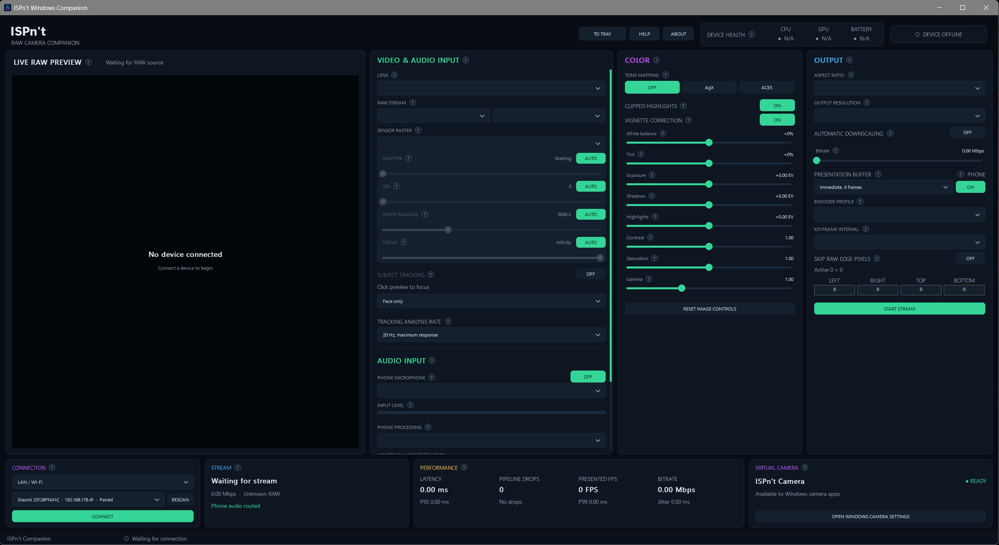
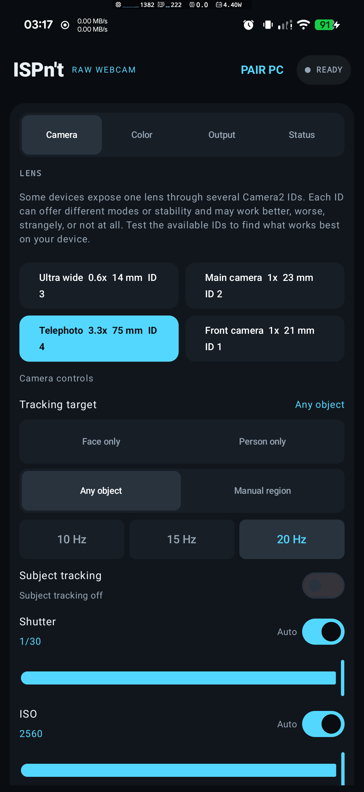
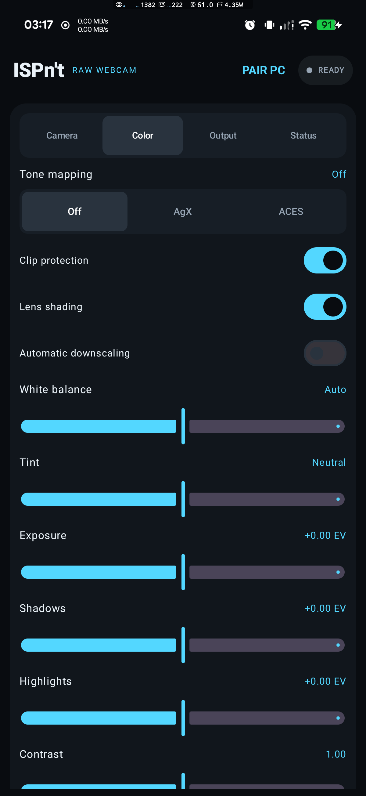
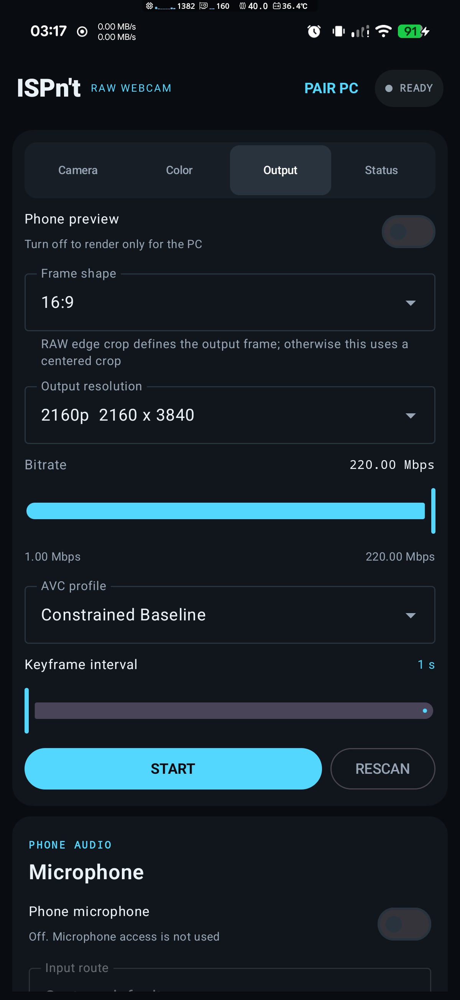
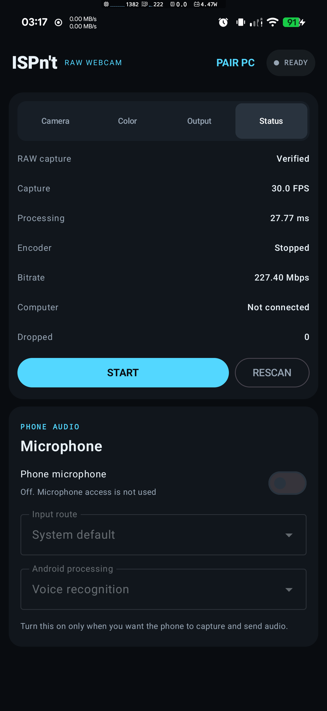

# ISPn't

ISPn't turns a supported Android phone into a controllable Windows webcam using the phone's RAW camera output.

It is made for people who want a cleaner and more direct image than the heavily processed look common in stock camera and webcam apps. ISPn't gives you control over how the RAW sensor image is developed, while the Windows companion makes the finished video available to other applications as **ISPn't Camera**.

## What makes ISPn't different

Most phone camera apps send the image through the manufacturer's Image Signal Processor, usually called the ISP. This path is extremely efficient and is one reason a stock camera can record high resolutions and frame rates with relatively low processing load. It also decides much of the final look before another app receives the image.

Depending on the phone, that look can include strong sharpening, aggressive noise reduction, artificial texture, manufacturer-selected colors, and tone processing that cannot be fully undone later.

ISPn't takes a different path. It reads a RAW buffer exposed by Android's camera system and performs its own real-time image processing. This can produce a more natural starting point and gives you direct control over color, brightness, contrast, tone mapping, and other parts of the image.

The stream delivered to Windows is encoded video, not a RAW recording. RAW is used as the source for the live image-processing pipeline.

## Interface

| Android camera and tracking controls | Android color controls |
| --- | --- |
|  |  |

| Android output controls | Android status and microphone controls |
| --- | --- |
|  |  |

## Project status

ISPn't is a work in progress and is being actively improved. Bugs, unexpected behavior, and device-specific compatibility problems may occur, especially because Android camera and encoder implementations vary considerably between manufacturers and models.

Reproducible problems will be investigated and fixed where possible. Performance, latency, stability, and device compatibility will also be optimized when practical improvements can be made. Some limitations come directly from the phone's hardware, camera driver, exposed RAW modes, encoder, or thermal behavior and cannot always be solved in software.

Useful bug reports should include the phone model, Android version, selected camera ID, RAW format, sensor resolution, output settings, connection type, and relevant logs when available.

## How it works

1. The Android app finds camera IDs that expose usable RAW output.
2. You choose a lens route, RAW format, sensor resolution, and frame rate.
3. The phone processes each RAW frame and sends the encoded result over USB or the local network.
4. The Windows companion receives and displays the stream.
5. The companion publishes the video as **ISPn't Camera** for supported Windows camera applications.

The phone does the demanding RAW capture, image processing, and live encoding. The Windows companion handles the connection, preview, stream controls, performance information, audio routing, and virtual camera output.

## Camera and lens selection

Android devices do not always expose their cameras in a simple way. One physical lens may appear through several camera IDs, and some additional physical IDs may be hidden behind a logical camera.

ISPn't scans for additional usable IDs and shows the ID beside each lens entry. Similar names do not necessarily mean the entries behave identically. One ID may offer different resolutions, frame rates, controls, image quality, or stability than another ID connected to the same physical lens.

Some IDs may work well, some may behave strangely, and some may not work at all. This depends on the device and its camera implementation. Test the available IDs and use the route that works best on your phone.

The input controls include:

- Lens and camera ID
- RAW_SENSOR, RAW10, or RAW12 format when reported by the phone
- Sensor raster, which is the resolution read from the camera sensor
- Capture frame rate
- Automatic or manual shutter speed
- Automatic or manual ISO
- Automatic or manual white balance
- Automatic or manual focus
- Optional subject tracking for a face, person, object, or manually selected region

Higher sensor resolutions and frame rates require more processing power, memory bandwidth, battery power, and cooling.

## Experimental ML-based subject tracking

ISPn't includes experimental subject tracking that can move the phone camera's focus region as a selected subject moves through the image. It uses on-device machine-learning analysis together with visual tracking and offers several choices:

- **Face only** looks for and follows a face.
- **Person only** looks for and follows a person.
- **Any object** allows a detected object to be selected and followed.
- **Manual region** follows an area selected directly in the preview.

The tracking analysis rate can be set to 10, 15, or 20 Hz. A higher rate can react faster, but it also uses more phone processing power and may create additional heat. A lower rate is more efficient and may be sufficient for slower movement.

This feature is a work in progress and should not be treated as guaranteed autofocus behavior. Results depend on the phone, lens ID, autofocus-region support, lighting, subject visibility, movement, and available processing performance. Tracking may work well in one situation, lose the subject, choose the wrong target, behave inconsistently, or not work at all. It will continue to be improved where practical.

## Image controls

ISPn't develops the RAW sensor data into the finished video image in real time. The available color controls include:

- White balance for warmer or cooler color
- Tint correction for green or magenta casts
- Exposure adjustment
- Separate shadow and highlight adjustment
- Contrast
- Saturation
- Gamma for midtone brightness
- Clipped-highlight neutralization
- Vignette correction
- AgX, ACES, or direct tone mapping

AgX provides a smooth highlight roll-off. ACES provides a stronger cinematic contrast. Turning tone mapping off keeps a more direct rendering.

Clipped-highlight neutralization can reduce strong color shifts in overexposed lights or windows. Vignette correction evens out natural edge darkening, though brightening dark edges can make edge noise more visible.

## Output and performance controls

The sensor raster and Windows output resolution are separate choices. The phone can read a larger RAW sensor image and produce a smaller output stream, but that still requires the phone to capture and process the larger RAW frame first.

Output controls include:

- Aspect ratio
- Output resolution
- Video bitrate
- Encoder profile
- Keyframe interval
- Windows presentation buffering
- Optional phone preview
- Automatic downscaling
- RAW edge cropping

Lower output resolutions reduce encoding load, bandwidth, battery use, and storage use in a recording application. Higher output resolutions preserve more detail but require more resources.

Automatic downscaling is intended to protect latency and stability. When the phone cannot sustain the selected stream, ISPn't can step processing and encoding down to a more manageable resolution. It waits for stable recovery before stepping back up, which avoids constant switching. The tradeoff is a temporary reduction in sharpness.

The presentation buffer controls how Windows displays arriving frames:

- **Immediate** prioritizes the lowest delay.
- **Smooth** adds one frame of delay for steadier motion.
- **Adaptive** changes buffering when network timing varies.

Turning off the phone preview can reduce display power use and heat when only the Windows preview is needed.

RAW edge cropping removes a selected number of pixels from the sensor borders before processing. This is useful when a camera exposes invalid, dark, or calibration pixels around its RAW image.

## Realistic device expectations

The phone must expose a real RAW camera stream and must be able to process and encode it continuously. Some older, entry-level, restricted, or poorly implemented devices cannot sustain this workload.

A phone being able to record 4K60 or 4K120 in its stock camera does not mean it can process the same resolution and frame rate through ISPn't. The stock camera uses the phone's dedicated ISP path, which is designed for speed and efficiency. ISPn't deliberately uses the more demanding RAW path to avoid much of that baked-in processing.

Lower performance than the stock camera at the same settings is an expected hardware tradeoff. It is not a direct comparison between two apps doing the same work.

RAW processing can make the phone noticeably warmer during long sessions. Frame drops can occur when the phone overheats, the selected settings exceed its processing ability, or the network cannot deliver data consistently. These are physical device and connection limits, not automatically a software fault.

For a cooler and more stable stream:

- Try 1080p at 30 fps before attempting higher modes.
- Use 24 fps when very smooth motion is not required.
- Lower the sensor or output resolution.
- Use a sensible bitrate.
- Enable automatic downscaling.
- Turn off the phone preview when it is not needed.
- Remove a thick phone case and provide airflow.
- Avoid direct sunlight.
- Consider a properly mounted phone Peltier cooler for demanding sessions.

Avoid cooling that can create condensation. If the phone becomes too warm or begins dropping frames, reduce the workload.

## Phone microphone audio

Phone microphone capture is optional and defaults to OFF.

When it is OFF, ISPn't does not request microphone permission, open the microphone, or send phone audio. If Android microphone permission was already granted, turning capture OFF stops using the microphone but does not revoke that permission.

When enabled, ISPn't sends 48 kHz mono microphone audio to the companion. You can select a phone input route and a supported Android processing mode. Voice-focused processing can help speech, while a less processed mode may sound more natural for music. Digital gain is available in the companion, but excessive gain also raises background noise and can cause clipping.

The companion sends phone audio to a selected Windows playback endpoint. To use it as a microphone in another application, select a separately installed virtual-audio playback device in ISPn't, then select that product's matching recording endpoint in the destination application.

ISPn't does not include or install third-party virtual-audio software.

## Connection options

### USB

USB uses ADB and is usually the most predictable connection method.

1. Enable Developer options and USB debugging on the phone.
2. Connect the phone with a USB data cable.
3. Accept the USB debugging authorization prompt on the phone.
4. Open ISPn't on the phone.
5. Select **USB / ADB** in the companion and connect.

The Windows installation includes the required ADB files. A separate ADB installation and PATH configuration are not required.

If the phone is not detected, confirm that the cable supports data, try another USB port, and install the phone manufacturer's Windows USB driver if required.

### Direct LAN or Wi-Fi

Direct LAN mode does not use ADB. The phone and computer must be connected to the same local network.

The first connection requires manual pairing:

1. Open ISPn't on the phone and choose **Pair PC**.
2. Select **LAN / Wi-Fi** in the companion.
3. Select the manual IP option.
4. Enter the phone's IP address and the six-digit pairing key shown by the Android app.
5. Connect and allow the companion to save the paired device.

The phone cannot be discovered automatically before the first successful pairing. For later connections, keep ISPn't open and keep both devices on the same network. A new pairing key can be generated from the phone when previously paired computers should no longer connect.

Wi-Fi performance depends on signal quality, interference, network congestion, and router behavior. USB is usually the better choice when consistent latency is more important than freedom of movement.

## Performance information

The companion shows the information needed to judge stream health:

- End-to-end preview latency
- Phone and Windows pipeline drops
- Presented frame rate
- Video bitrate
- Delivery jitter
- Sensor resolution and frame rate
- RAW format
- Battery and device health
- Virtual camera state

A healthy stream normally has low and stable latency, zero or very few drops, and a presented frame rate close to the selected capture rate.

## System requirements

### Android phone

- Android 11 or newer
- 64-bit ARM device
- At least one camera that exposes RAW output through Android
- Hardware video encoding support for the selected output
- Enough sustained performance for the selected RAW resolution and frame rate

Available lenses, formats, resolutions, frame rates, and manual controls depend entirely on what the phone reports and what its camera implementation can sustain.

### Windows computer

- Windows 11 build 22000 or newer
- A supported x64 Windows system
- Permission to install the companion and virtual camera

## Download and install

Download the latest release from the repository's **Releases** section. A normal release contains:

- `Setup.exe`
- `ISPnt.apk`
- `README.txt`

### Install on Windows

1. Keep the three release files together.
2. Run `Setup.exe`.
3. Approve the administrator prompt.
4. Complete setup.
5. Open **ISPn't Companion** from the desktop or Start menu.

Setup installs the Windows companion, bundled ADB files, and ISPn't virtual camera. It also copies the Android APK to `Public Documents\ISPnt` and creates an **Open Android APK Folder** shortcut.

### Install on Android

1. Transfer `ISPnt.apk` to the phone.
2. Open the APK and allow installation from that source if Android asks.
3. Install and open ISPn't.
4. Grant camera permission.
5. Grant microphone permission only if phone microphone capture is wanted.

The Windows installer does not install the APK on the phone automatically.

## Using ISPn't Camera

After the phone is connected and streaming, open the camera settings in OBS, a browser, recording software, or a supported meeting application and select **ISPn't Camera**.

Only one Windows companion instance can run at a time. Closing the companion asks for confirmation, and it can be minimized to the system tray when you want it to remain active without occupying the taskbar.

## Troubleshooting

### No compatible camera appears

The phone may not expose RAW output, or its RAW implementation may not be usable by ISPn't. Stock camera features alone do not prove that third-party RAW streaming is available.

### A lens ID does not work correctly

Try another ID for the same lens. Camera IDs can expose different modes and behavior even when they point to the same physical camera.

### The stream is hot, delayed, or dropping frames

Lower the sensor resolution, output resolution, frame rate, or bitrate. Try 30 or 24 fps, enable automatic downscaling, turn off the phone preview, and improve phone cooling.

### USB cannot find the phone

Confirm that USB debugging is enabled and authorized. Use a data-capable cable, try another port, and install the phone manufacturer's USB driver if Windows requires it.

### The phone is not found over LAN

Complete the first pairing manually with the phone's IP address and six-digit key. Confirm that both devices are on the same local network and that ISPn't is open on the phone.

### ISPn't Camera does not appear

Complete the Windows setup with administrator permission. Restart the destination camera application after installation so it refreshes its camera list.

## Current version

Version 1.0.0

Developer: JohnTheFarm3r
